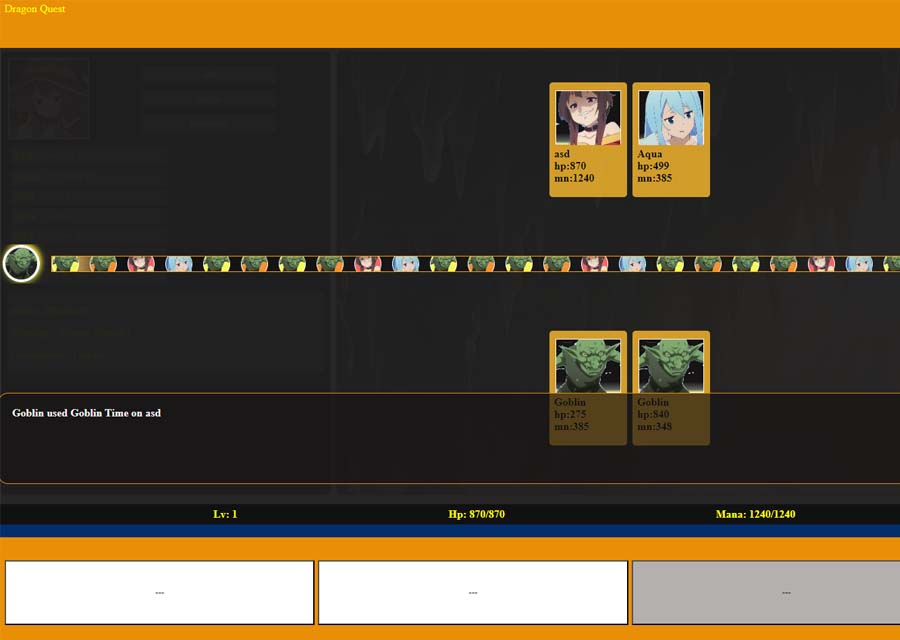

# RPG#2

## Introduction

RPG#2 is a role-playing game developed as a practice project to improve my JavaScript skills. This project is inspired by my love for RPG games and aims to provide an engaging and interactive experience.

## Features

- Responsive design
- LocalStorage for data management
- Title screen and storyline
- Character creation with stat initialization
- User panel with future update capabilities
- Fight mechanics with turn-based system
- Art sourced from AI and screenshots from the internet for the time being

## Demo

### UI and Fight Mechanics

*Title screen of RPG#2*

*Character creation screen*

*Fight mechanics in action*

## Progress Updates

### (05/12/2024)

- Initial development of the frontend.
- Implemented responsiveness.
- Started planning the scripts.

### (05/13/2024)

- Worked on the script concept.
- Decided to handle data using LocalStorage.

### (05/14/2024)

- Added the title screen.
- Planned the storyline.

### (05/15/2024)

- Finalized the initialization display of stats upon character creation.
- Finished the user panel along with functions for future updates to the display and character data.

### (05/20/2024)

- Completed fight mechanics.
- Added a small avatar bat that shows the sequence of characters' turns as a guide for the player.
- Taking a break after this.

